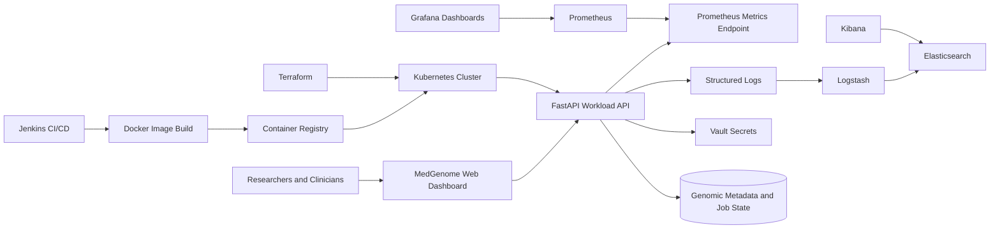
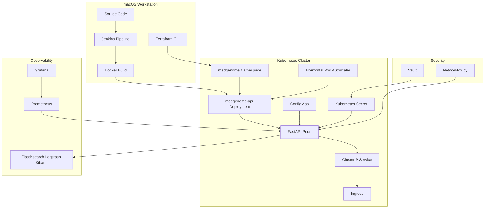

# Project MedGenome - Global Genomics Research Platform

Project MedGenome is a small working business application plus a complete DevOps lifecycle around it. The application represents a genomics research operations portal for precision medicine, disease research, and pharmaceutical workloads.

The app is intentionally demo-sized, but it shows the full flow: users log in, upload genomic files, see the actual uploaded data size, track analysis workloads, expose APIs, emit Prometheus metrics, run through Docker/Jenkins/Kubernetes, and connect to monitoring, logging, Vault, Terraform, and disaster recovery documentation.

## Business Problem

A consortium of healthcare organizations and research institutions operates a genomics platform that processes large genomic datasets and computational workloads. Research growth creates pressure on scalability, deployment automation, monitoring, logging, secrets, and recovery.

This project demonstrates how a DevOps ecosystem can support that platform.

## What The App Does

- Login-protected operations dashboard using demo credentials `admin/admin`.
- Genomic dataset upload with actual uploaded byte-size tracking.
- Dataset registry with study, owner, file type, size, upload time, and linked workload.
- Compute workload registry for WGS, RNA-Seq, Variant Calling, GWAS, and Pharma Cohort pipelines.
- REST APIs for summary, workloads, datasets, health, readiness, and simulation.
- Prometheus metrics for HTTP requests, latency, uploads, uploaded bytes, datasets, active jobs, and data size.

## Demo Login

```text
username: admin
password: admin
```

## Ports

| Component | URL / Port | Purpose |
|---|---:|---|
| FastAPI app | `http://localhost:8000` | Main MedGenome dashboard and API |
| Docker app | `http://localhost:9000` | Same app running as a container |
| Kubernetes app | `http://localhost:8800` | App exposed by Kubernetes port-forward |
| Jenkins | `http://localhost:8080` | CI/CD pipeline UI |
| Prometheus | `http://localhost:9090` | Metrics scraping and query UI |
| Grafana | `http://localhost:3000` | Metrics dashboards |
| Elasticsearch | `http://localhost:9200` | Log storage/search API |
| Logstash TCP input | `localhost:5000` | Structured JSON log input |
| Logstash Beats input | `localhost:5044` | Beats-compatible log input |
| Kibana | `http://localhost:5600` | Log search and visualization UI |
| Vault | `http://localhost:8200` | Secret management UI/API |

## Quick Demo

Run the automated demo launcher:

```bash
./runner.sh
```

It starts the FastAPI app, Prometheus/Grafana, ELK, and Vault, then opens the important pages in your browser.

Manual app start:

```bash
python3 -m venv .venv
source .venv/bin/activate
pip install -r requirements.txt
uvicorn app.main:app --host 0.0.0.0 --port 8000
```

Open:

```text
http://localhost:8000
```

## Important URLs

| Page | URL |
|---|---|
| App dashboard | `http://localhost:8000` |
| API docs | `http://localhost:8000/docs` |
| Health check | `http://localhost:8000/healthz` |
| Readiness check | `http://localhost:8000/readyz` |
| Raw metrics | `http://localhost:8000/metrics` |
| Dataset API | `http://localhost:8000/api/datasets` |
| Summary API | `http://localhost:8000/api/summary` |
| Workload API | `http://localhost:8000/api/workloads` |

## DevOps Deliverables

| Requirement | Status | Location |
|---|---|---|
| Working web app/dashboard/API | Done | `app/main.py` |
| Source code repository | Ready locally | Git repo root |
| Dockerfile and image workflow | Done | `Dockerfile` |
| Jenkins CI/CD pipeline | Done | `Jenkinsfile` |
| Terraform scripts | Done | `infra/terraform/` |
| Kubernetes deployment files | Done | `k8s/` |
| Prometheus and Grafana monitoring | Done | `monitoring/` |
| ELK logging stack | Done | `elk/` |
| Vault secret management | Done | `vault/` |
| Architecture diagram | Included below | README |
| Deployment diagram | Included below | README |
| Disaster recovery plan | Included below | README |
| Demonstration screenshots | Folder ready | `screenshots/` |
| Project documentation | This file | `README.md` |

## Component Runbook

| Component | Port | Why it exists | Run command |
|---|---:|---|---|
| FastAPI app | `8000` | Main web dashboard and API for the MedGenome demo | `uvicorn app.main:app --host 0.0.0.0 --port 8000` |
| Docker app | `9000` | Shows the app packaged as a portable container | `docker build -t medgenome-platform:latest . && docker run --rm -p 9000:8000 --name medgenome-platform medgenome-platform:latest` |
| Kubernetes app | `8800` | Exposes the Kubernetes Service to the local browser | `kubectl -n medgenome port-forward service/medgenome-api 8800:80` |
| Jenkins | `8080` | Automates test, Docker build, and Kubernetes deploy | `brew services start jenkins-lts` |
| Prometheus | `9090` | Scrapes and stores app metrics | `docker-compose -f monitoring/docker-compose.yml up -d` |
| Grafana | `3000` | Visualizes Prometheus metrics | `docker-compose -f monitoring/docker-compose.yml up -d` |
| Elasticsearch | `9200` | Stores indexed logs | `docker-compose -f elk/docker-compose.yml up -d` |
| Logstash | `5000` | Receives structured JSON logs and forwards them to Elasticsearch | `docker-compose -f elk/docker-compose.yml up -d` |
| Kibana | `5600` | Searches and visualizes Elasticsearch logs | `docker-compose -f elk/docker-compose.yml up -d` |
| Vault | `8200` | Stores secrets and access policies | `docker-compose -f vault/docker-compose.yml up -d` |
| Terraform | `n/a` | Provisions namespace and monitoring through Helm | `cd infra/terraform && terraform init && terraform plan && terraform apply` |

## Local API Checks

```bash
curl http://localhost:8000/healthz
curl http://localhost:8000/readyz
curl http://localhost:8000/api/summary
curl http://localhost:8000/api/workloads
curl http://localhost:8000/api/datasets
curl -X POST http://localhost:8000/api/simulate
```

Prometheus metrics to show:

```text
medgenome_http_requests_total
medgenome_active_jobs
medgenome_dataset_petabytes
medgenome_uploads_total
medgenome_uploaded_bytes_total
medgenome_datasets_total
```

## Docker

Docker packages the app and dependencies into a portable image.

```bash
docker build -t medgenome-platform:latest .
docker run --rm -p 9000:8000 --name medgenome-platform medgenome-platform:latest
```

Verify:

```bash
curl http://localhost:9000/healthz
```

## Jenkins

Jenkins is the CI/CD automation server. The `Jenkinsfile` performs:

- tool checks
- dependency installation
- smoke test using Python compile
- Docker image build
- Kubernetes deployment

Start Jenkins:

```bash
brew services start jenkins-lts
open http://localhost:8080
```

Initial password if needed:

```bash
cat ~/.jenkins/secrets/initialAdminPassword
```

## Kubernetes

Kubernetes runs the Docker image as pods and provides self-healing, service discovery, health checks, scaling, and rollout/rollback.

Key files:

- `k8s/namespace.yaml`: isolates project resources.
- `k8s/deployment.yaml`: runs two app replicas with probes and resource limits.
- `k8s/service.yaml`: exposes pods through a stable ClusterIP service.
- `k8s/hpa.yaml`: autoscaling configuration.
- `k8s/ingress.yaml`: host-based HTTP routing.
- `k8s/configmap.yaml`: non-secret configuration.
- `k8s/secret.yaml`: sensitive configuration placeholders.
- `k8s/network-policy.yaml`: traffic restrictions.

Deploy with Minikube:

```bash
minikube start --cpus=4 --memory=8192
eval "$(minikube docker-env)"
docker build -t medgenome-platform:latest .
kubectl apply -f k8s/namespace.yaml
kubectl -n medgenome apply -f k8s/
kubectl -n medgenome rollout status deployment/medgenome-api
kubectl -n medgenome port-forward service/medgenome-api 8800:80
```

Open:

```text
http://localhost:8800
```

Useful checks:

```bash
kubectl -n medgenome get all
kubectl -n medgenome get pods
kubectl -n medgenome get svc
kubectl -n medgenome get hpa
kubectl -n medgenome describe deployment medgenome-api
```

## Terraform And Helm

Terraform is Infrastructure as Code. In this project it creates the Kubernetes namespace and installs Prometheus/Grafana using Helm charts.

Helm is the Kubernetes package manager. This project uses Helm through Terraform, not as a custom application Helm chart.

```bash
cd infra/terraform
terraform init
terraform fmt
terraform validate
terraform plan
terraform apply
cd ../..
```

## Monitoring

Prometheus collects metrics from `/metrics`. Grafana visualizes those metrics.

Start:

```bash
docker-compose -f monitoring/docker-compose.yml up -d
open http://localhost:9090
open http://localhost:3000
```

Grafana login:

```text
username: admin
password: admin
```

Generate traffic:

```bash
for i in {1..20}; do curl -s http://localhost:8000/api/simulate > /dev/null; done
```

Prometheus target page:

```text
http://localhost:9090/targets
```

## Logging With ELK

ELK means Elasticsearch, Logstash, and Kibana.

- Logstash receives structured JSON logs.
- Elasticsearch stores and indexes logs.
- Kibana searches and visualizes logs.

Start:

```bash
docker-compose -f elk/docker-compose.yml up -d
open http://localhost:5600
```

Send sample structured logs:

```bash
printf '{"service":"medgenome-api","level":"info","message":"analysis job completed","job_id":"MG-1003"}\n' | nc localhost 5000
printf '{"service":"medgenome-api","level":"warn","message":"queue depth high","active_jobs":8}\n' | nc localhost 5000
```

Verify Elasticsearch:

```bash
curl http://localhost:9200/_cat/indices?v
```

## Vault

Vault stores sensitive values such as database URLs, API tokens, passwords, and credentials. In this demo Vault runs in development mode.

Start:

```bash
docker-compose -f vault/docker-compose.yml up -d
export VAULT_ADDR=http://127.0.0.1:8200
export VAULT_TOKEN=root
vault status
```

Create and read a demo secret:

```bash
vault secrets enable -path=secret kv-v2
vault policy write medgenome vault/policy.hcl
vault kv put secret/medgenome/api DATABASE_URL="postgresql://medgenome:change-me@db:5432/research" API_TOKEN="replace-in-prod"
vault kv get secret/medgenome/api
```

## Architecture Diagram



## Deployment Diagram



## Disaster Recovery

Recovery objectives:

- RTO: 30 minutes for application service restoration.
- RPO: 15 minutes for operational metadata in a production design.
- Priority 1: restore app, API, health endpoints, and workload visibility.
- Priority 2: restore metrics, logs, and dashboards.

Demo limitation:

The current app stores uploaded dataset metadata in memory. Restarting the app clears uploaded demo data. In production, genomic files would go to S3/MinIO/GCS and metadata would go to PostgreSQL with backups.

Pod failure recovery:

```bash
kubectl -n medgenome get pods
kubectl -n medgenome delete pod -l app=medgenome-api
kubectl -n medgenome get pods --watch
```

Rollback a bad deployment:

```bash
kubectl -n medgenome rollout history deployment/medgenome-api
kubectl -n medgenome rollout undo deployment/medgenome-api
kubectl -n medgenome rollout status deployment/medgenome-api
```

Recreate namespace and app:

```bash
kubectl apply -f k8s/namespace.yaml
kubectl -n medgenome apply -f k8s/
kubectl -n medgenome rollout status deployment/medgenome-api
kubectl -n medgenome port-forward service/medgenome-api 8800:80
curl http://localhost:8800/healthz
```

Backup current Kubernetes state:

```bash
mkdir -p backups
kubectl -n medgenome get all,configmap,secret,ingress,hpa -o yaml > backups/medgenome-k8s-backup.yaml
kubectl -n medgenome get pods -o wide > backups/pod-placement.txt
```

## Screenshots

```bash
mkdir -p screenshots
open http://localhost:8000
screencapture -x screenshots/01-application-dashboard.png
open http://localhost:8000/docs
screencapture -x screenshots/02-api-docs.png
open http://localhost:9090
screencapture -x screenshots/03-prometheus.png
open http://localhost:3000
screencapture -x screenshots/04-grafana.png
open http://localhost:5600
screencapture -x screenshots/05-kibana.png
```

## Cleanup

```bash
kubectl delete namespace medgenome
docker-compose -f monitoring/docker-compose.yml down
docker-compose -f elk/docker-compose.yml down
docker-compose -f vault/docker-compose.yml down
docker rm -f medgenome-platform
brew services stop jenkins-lts
```
